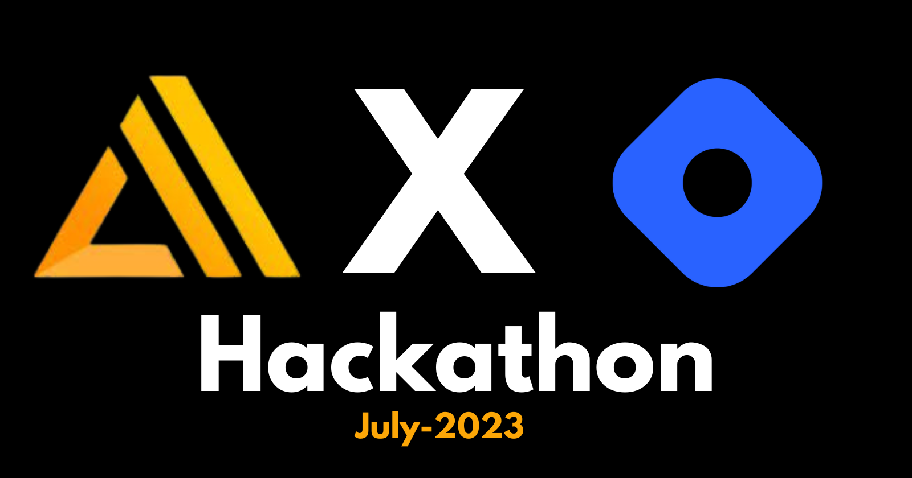
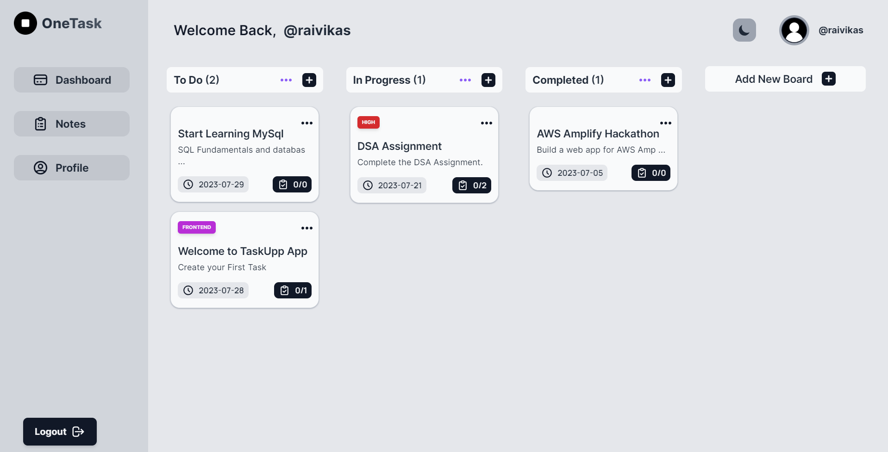
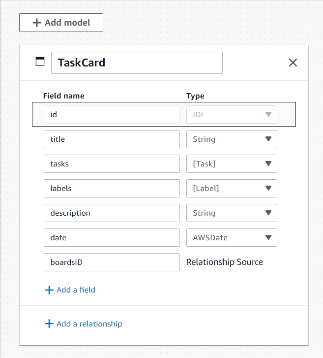
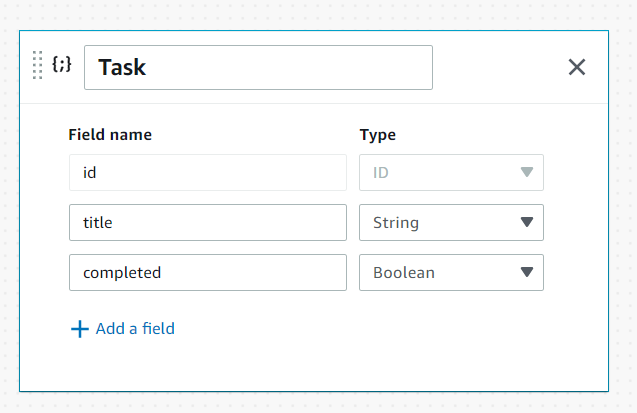
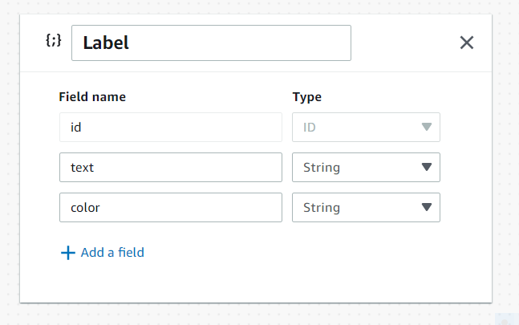
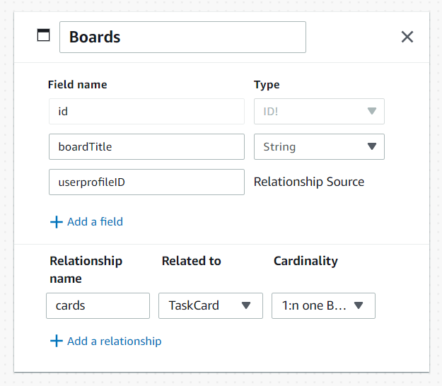
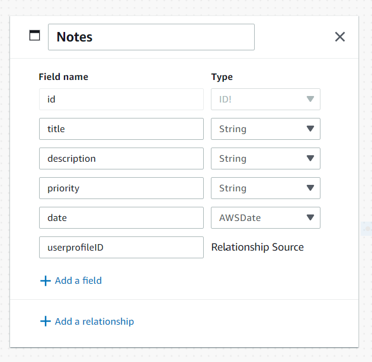
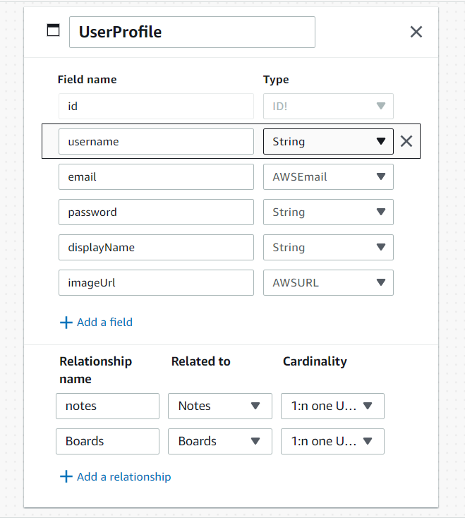

# Build with AWS Amplify Hackathon (AWS Amplify X Hashnode) — July 2023
  
  

### Project Task

**To Build an exciting Open-Source app of your choice using AWS Amplify as Backend and its other features during the whole of September. Publish an article on your Hashnode blog about the process of creating and launching your app for a chance to win one of the 15 cash prizes and swags!**

[Live Demo URL](https://onetask.vercel.app)




### Project Overview

It consits of :

* Header
* Hero Section
* Onboarding Page
* Profile Setting Page
* Dashboard Page
* Notes Page
* Footer
* Dark Mode & Light Mode Functionality

and many more components...

### Tech Stack Used

**This is my all-time favorite tech stack:**

- Next.js (Fullstack Framework for React.js)
- React.js (Front-end UI Library)
- Tailwind CSS (CSS Framework)
- AWS Amplify Studio (For Database)
- Vercel (For Hosting the App)

### UI Resources Used

* Images - (Google Images)
* SVG Icons - (Hero Icons by Tailwind CSS)
* Fonts (Inter, Manrope & Urbanist)- (Google fonts)


### How to use  OneTask

1. First, visit the onetask.vercel.app , and sign up using email, username and password.

2. After that you will be redirected to Onboarding Page.

3. Then, you will be redirected to the dashboard.

4. You can update your profile in the profile tab.

5. On the Dashboard you can Add a Board and Inside that Board you can Add Tasks.

6. You can (Drag and Drop your Task cards Between Different Boards).

7. You can Create, Delete, Edit and your Task cards and Notes.


### The Code

Steps to run the app locally:


#### Step-1: Git Clone the project

```bash
   git clone https://github.com/raiv200/OneTask.git
```

#### Step-2: Install the dependencies

```bash
  npm install
```

#### Step-3: You do need to create Aws Amplify Account and the various Schema Models

 1. Go o aws.amazon.com and Sign Up.
 2. After that, in the search type Amplify Studio and click on it.
 3. Set up Amplify Studio by giving a suitable name for the app and set environment to dev mode.
 4. Then after that you will see something like Launch Amplify Studio. Click on it and proceed.

 After that follow step 4.


#### Step-4: Create Schema Models

 1. I have used (username with email) as a part of AWS Amplify Authentication.

 2. For the Schema Models, here is a screenshot of the Schema Models that I Created.









#### Step-5: Start the development server

Now open your project in your favorite IDE , (VsCode) and then start the development server.

```bash
   npm run dev
```


